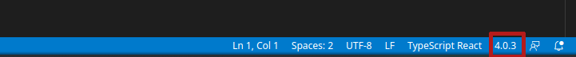
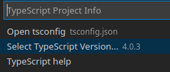
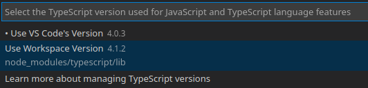

# Personal area

## About Project
Personal area with your contacts list, when you can add, edit, or delete the contacts. Also you can use a search bar for fast find contact by name.

## __Important!__
Maybe you may get an error like

```zsh
- compilerOptions.jsx must be react-jsx (to support the new JSX transform in React 17)
```
This happening because VSCode using an older version of typescript (4.0.3), while the typescript version shipped with the project is (4.1.2).

For fix this error following:

1. Go to the command palette `CTRL+Shift+P`.
2. Choose "TypeScript: Select a TypeScript Version...".
3. Choose "Use workspace Version".

Or you can use status bar:







## List of technologies
- Type script
- React
- Json-server

## For starting use this application you should initialize a project

1. First of all, move to directory where you want to see this repo, with command in a terminal:

```zsh
cd $HOME/path/to/your-folder
```

2. Then in the terminal copy this repo with command:
```zsh
git clone https://github.com/Mirhaydarov/personal-area.git
```

3. And initial project:
```zsh
cd personal-area
npm i
```
4. For start server use command: 
```zsh
npm run server
```

5. For start app use command:
```zsh
npm run serve
```

- Server start in http://localhost:8080
- App start in http://localhost:3000

You can find more commands in root project directory in file package.json to section __"scripts"__.